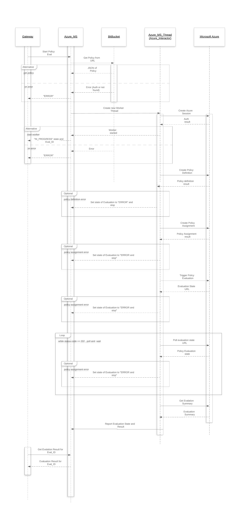
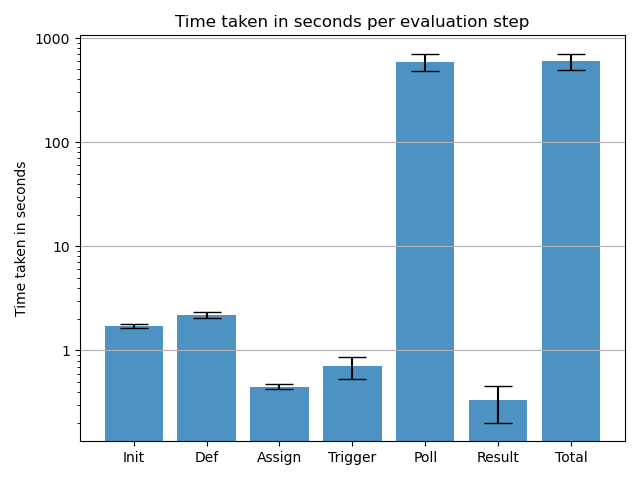
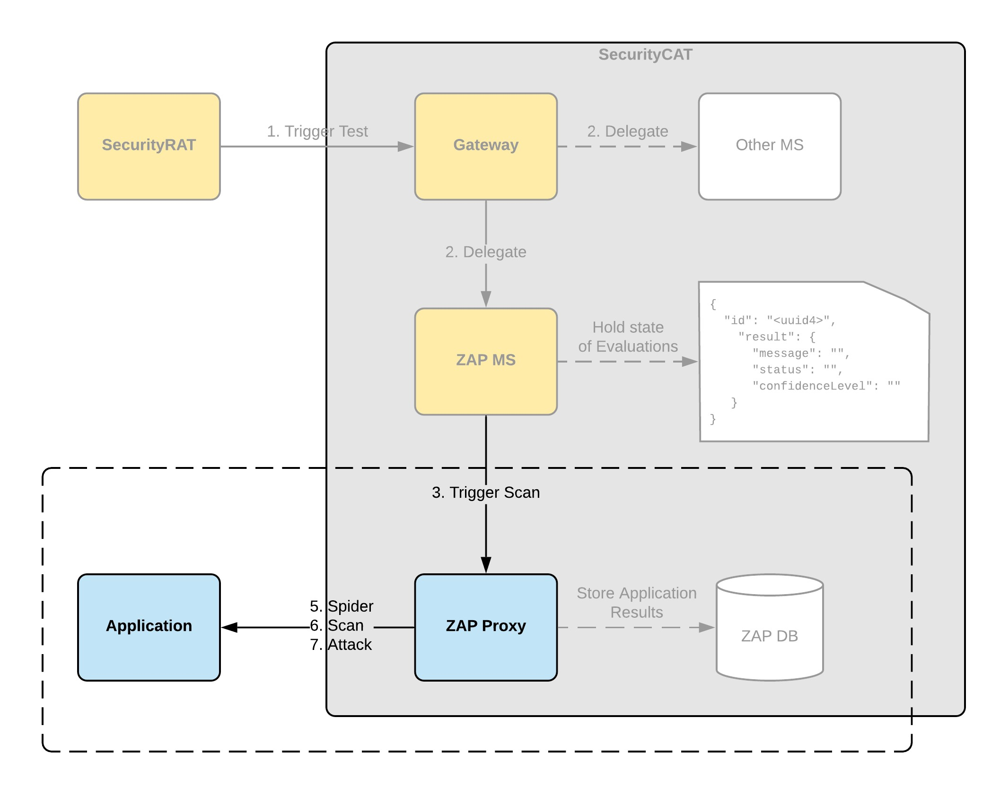
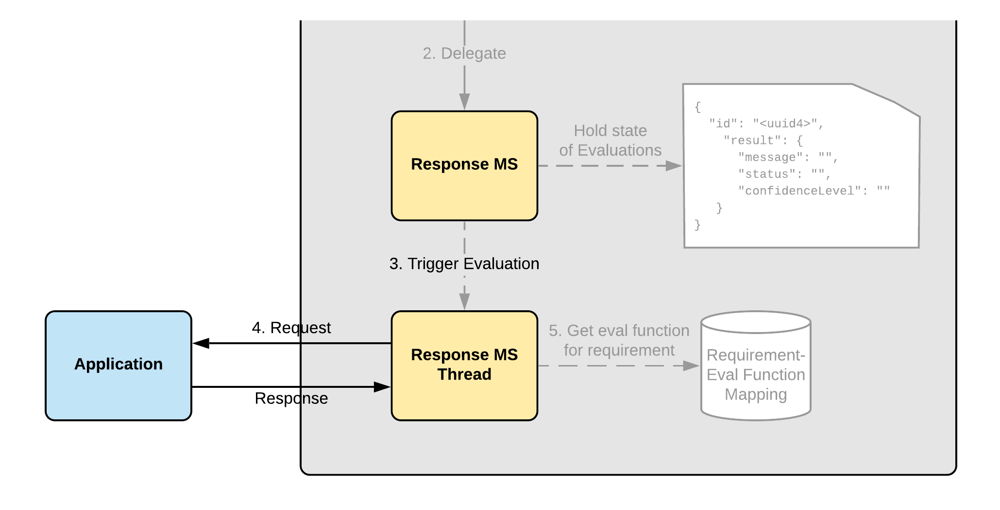

# Automated Security and Policy Testing for Cloud Applications - Thesis & SecurityCAT PoC

This thesis hold the proof of concept implementation for the SecurityCAT (Compliance Automation Tool) developed for my thesis about "Automated Security and Policy Testing for Cloud Applications using a Requirement Automation Tool (SecurityRAT)".
It also contains the testing and measuring scripts that have been used for runtime analysis. 

The thesis folder leads to the full and final thesis written about this topic to finalize my "Bachelor of Science" degree.

## Gateway

### Prerequisities
- Redis
- Installed Python libraries `pip install -r requirements.txt`
- the ```securityrat_url``` variable in ```gateway.py``` set to the URL of your actual SecurityRAT instance
 
### How to launch
1. Launch your Redis instance (local port 6379 is expected by default)
1. Start Celery ```celery worker -A gateway.celery --loglevel=info```
1. Starting gateway:  ```python3 ./gateway.py``` 


## Azure MS

In order to retrieve the policy defintion JSON from SocialCoding (BitBucket) we need to auth with Username and Password.
The bitbucket_req.py file loads these two values from the following environment variables.

The sequence flow of the Azure MS can be described as follows:


### Execution

```bash
export SOCIALCODING_USER=*****
export SOCIALCODING_PW=*****
```

Information necessary for policy evaluation
```json
{
  "azure_tenant_id": "Directory id of the azure AD (Properties tab)",
  "azure_subscription_id": "Subscription id of the azure subscription",
  "azure_client_id": "Client id of the application service principal",
  "azure_client_secret": "Client secret of the application service principal",
  "policy_json_url": "URL of the policy json stored in socialcoding (bitbucket)"
}
```


#### Policy Eval times taken:

The following test results have been collected on a constant state of Azure Policies. After each Evalutation, the Policy Definition and Assignment have been deleted in order to restart the test run without conflicts.

Legend:
- **Run**       - id of the run
- **Init**      - time taken to initialize the thread and authenticate with azure
- **Def**       - time taken to create the policy definition
- **Assign**    - time taken to create the policy assignment
- **Trigger**   - time taken to trigger the evaluation of assigned policy
- **Poll**      - time taken for the evaluation (result polled every 10s)
- **Result**    - time taken to retrieve the result from azure
- **Total**     - summed up time taken for the full evaluation

|Run|Init|Def|Assign|Trigger|Poll|Result|Total|
|---|----|---|------|-------|----|------|-----|
|1|1.7217|2.2734|0.4247|0.8354|495.3885|0.2503|500.8941|
|2|1.7406|2.2096|0.4401|0.8000|497.7047|0.2558|503.1510|
|3|1.6200|2.1100|0.4400|0.4597|432.9334|0.2495|437.8129|
|4|1.7029|2.1439|0.4402|0.8182|744.4237|0.2742|749.8034|
|5|1.6499|2.0804|0.4397|0.4901|557.6947|0.5737|562.9288|
|6|1.7419|2.5185|0.4397|0.5602|558.2836|0.2810|563.8251|
|7|1.8458|2.1392|0.4595|0.4974|557.0948|0.2902|562.3272|
|8|1.7432|2.0071|0.4360|0.8539|620.9929|0.5996|626.6329|
|9|1.7433|2.0500|0.4666|0.8832|742.9784|0.2385|748.3602|
|10|1.6376|2.3524|0.5124|0.8138|731.1293|0.2974|736.7433|

> All values in seconds.

Plotting those numbers in a bar chart gives the following, more readable chart.


## ZAP MS



### Prerequisities
- ZAP Proxy
 
### How to launch
1. Start ZAP Proxy
1. Copy API key from `Preferences` -> `API`
1. Starting gateway:  `python3 ./zap_ms.py` 

#### ZAP Eval times taken:


|Run|Init|D_Spider|A_Spider|A_Scan|Report|Total|
|---|----|---|------|-------|----|------|
|1|0.0293|10.0639|120.2846|40.2805|2.3807|173.0392|
|2|0.0204|10.0574|120.2172|180.3221|4.0307|314.6481|
|3|0.0144|60.1520|120.2625|861.8226|12.1002|1054.3518|
|4|0.0220|330.7147|120.2342|5069.7035|167.5021|5688.1767|

|Run|Runtime|Alerts|Low|Medium|High|
|---|-------|------|---|------|----|
|1|173.0392|10|5|2|0|
|2|314.6481|13|6|3|1|
|3|1054.3518|13|6|3|1|
|4|5688.1767|13|6|3|1|

## Response Check MS

The Response Check MS is a very minimal implementation of an abstraction checking interface that allows for requirement specific mappings from requirement definitions to actual checking implementations.



The reponse check microservice is powered by a mapping between requirement names and methods that check the given validity of the requirement.
Examples of such mappings are:
```python
__requirement_func_mapping = {
  "ASVS_3.0.1_10.10": lambda headers: 
      __check_headers_contains_elem(
        headers, "Public-Key-Pins"
      ),
  "ASVS_3.0.1_10.11": lambda headers: 
      __check_headers_contains_elem(
        headers, "Strict-Transport-Security"
      ),
  "ASVS_3.0.1_10.12": lambda headers: 
      __check_headers_contains_elem(
        headers, "Strict-Transport-Security", "preload"
     ),
}
```
