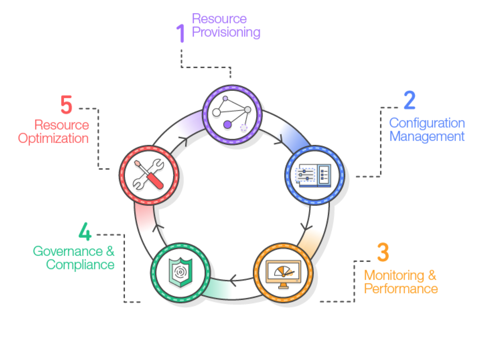
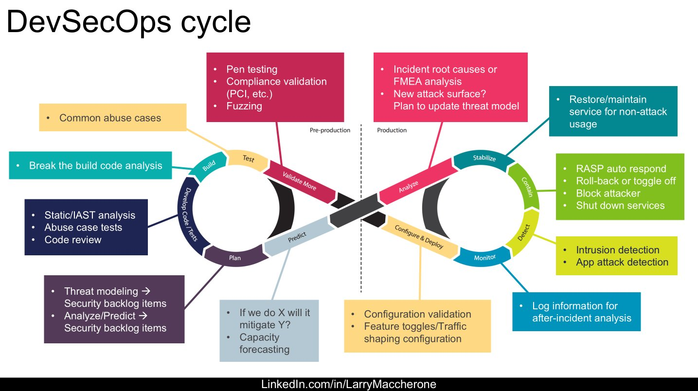
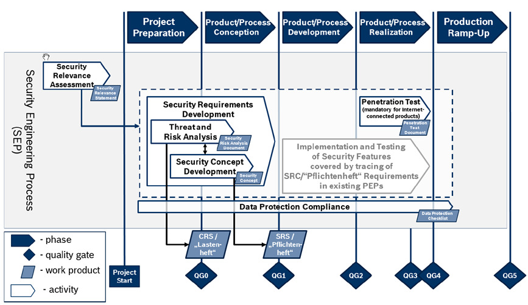
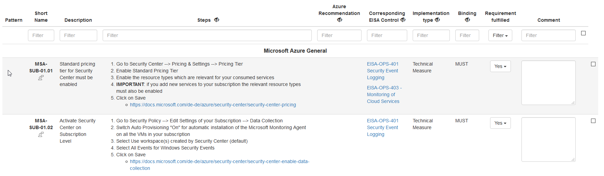
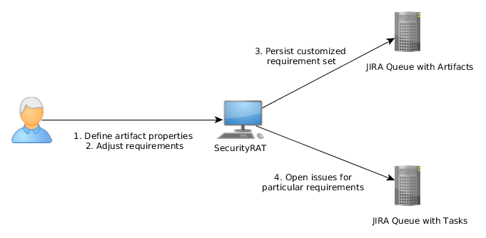

# Automated Security and Policy testing for cloud applications using a Requirement Automation Tool


## Acknowledgements


## Abstract


## List of Figures


## Introduction
Why testing at all?

Especially in the corporate world, projects pass so called Quality Gates which also require a baseline of compliance and security testing to be done.
(Quality Gates at Bosch) 

What happens when testing?
Model based approach, how to know what is wrong or right without a defined model?
Where is the model in Azure etc.
Abstract testing further with a middle layer that triggers testing for different platforms?
Lacks systematic approach

Requirement automation tool?

How is this thesis structured, what is described after what in which section?


### Testing Approaches

#### Model based: 
Replaces test design by automated test generation based on model of architecture or system
Infrastructure as code, tools e.g. terraform, infrastructure defined through a config file (properties easily testable)

Azure: https://docs.microsoft.com/en-us/azure/azure-resource-manager/templates/template-syntax

Compliance system in e.g. (Policies) Azure, (Config Rules) AWS 

Why we need a model?

https://books.google.de/books/about/Practical_Model_Based_Testing.html?id=8hAGtY4-oOoC&printsec=frontcover&source=kp_read_button&redir_esc=y#v=onepage&q&f=false

https://resources.sei.cmu.edu/asset_files/WhitePaper/2019_019_001_539335.pdf


#### Planning based: 
Testing based on planning is comparable to the model-based approach. The automatic generation of test cases also needs some model of the to be tested system. 
One of the differences is that planners (planning based tools) also create an attack plan and then transform the plan into suitable test cases.
https://hal.inria.fr/hal-01405274/document

The concept of planners is common for intelligent agents and autonomous systems. Transitions, and action sequences, are generated that transition the agent from the initial state into the given goal state.

The objective of planning based security testing is to ensure that applications reliably handle well-known attack patterns by modeling the attack as a sequence of known actions that are carried out in a specific order.
https://hal.inria.fr/hal-01405274/document

Instead of finding new vulnerabilities, handling known attacks is the focus of a planning-based approach.

In https://hal.inria.fr/hal-01405274/document the authors introduce an algorithm called PLAN4SEC(https://hal.inria.fr/hal-01405274/document) which makes use of an ordinary planner that is provided with a problem and domain description based on the DVWA (Damn vulnerable web app).

```
0: START X URL LO
1: SENDREQ X LO SE SI
2: RECREQ X SI
3: PARSE X M USERNAME PASSWORD TYPE 4: CHOOSERXSS X TYPE
5: ATTACKRXSS X XSSI M UN PW
6: PARSERESPXSS X SCRIPT RESP
7: PARSERESPXSSCHECK X SCRIPT RESP 8: FINISH X
```
> Example of the generated plan from https://hal.inria.fr/hal-01405274/document

The automatically generated plan is parsed by JavaFF(https://nms.kcl.ac.uk/planning/software/javaff.html), and according to Java functions are executed in order.


#### Test automation: 

Replaces manual execution of designed test cases by automated test scripts
We use test automation approach

fuzzing
dir busting
brute force


### Security Testing

#### Static source code analysis (Static Application Security Testing (SAST))
The "Static Source Code Analysis", as the name suggests, is performed without executing the program. It is a fundamental approach to review the formal correctness, data-flow, and even credential leaks.
Static code analysis is generally implemented as one of the first gates of continuous integration pipelines.

Depending on the focus of the analysis, there are different state-of-the-art providers for static code analysis like for example credential checking on Open-Source platforms like GitHub using GitGuardian (https://www.gitguardian.com) 

When focusing on security testing with static analysis, problems that can be identified with high confidence have to be targeted. Those include, for example, SQL Injections and Buffer Overflows.
The OWASP-project provides a list of tooling that can (https://owasp.org/www-community/Source_Code_Analysis_Tools) be used as part of a continuous integration pipeline. 
Once a vulnerability is found, the build fails and provides detailed reporting to the developers who have to fix the issues before future builds succeed.

However, this approach has many drawbacks. It has a high rate of false positives, which can significantly increase the time needed for manual testing and reviewing.
In addition to that, most security vulnerabilities are difficult to find automatically. Access control issues, insecure use of cryptography are only a few examples. Even misconfigurations cannot be identified without a model-based approach, as discussed before.

A more recent approach, Semmle QL, uses variant analysis to find problems in code based on a similar, known vulnerability. Code is treated as data and fed into the CodeQL engine together with custom queries that perform data analysis and track down known vulnerabilities. 

A straightforward query for finding all the comments that contain a TODO looks like the following.


```sql
import python

from Comment c
where c.getText().regexpMatch("(?si).*\\bTODO\\b.*")
select c
```


Much more complex queries for cases such as buffer overflows, critical recursion, or DOM XSS attack vectors are available. 
This approach enables more in-depth static analyses that can eliminate common known vulnerabilities.


#### Compliance and Governance
Compliance and Governance ensure the alignment of a given system with requirements, controls, and industry standards.
Even though they are both meant to protect an organization form the same threats and risks, they need to be looked at separately. 

##### Compliance
According to the Cambridge Dictionary, the term "compliance" describes the conformity of a system to a set of given rules and requirements (compliance, 2020). 
This means that a system must meet those requirements in order to conform to the regulations and rules of the organization. 

In the context of software systems, requirements can be both organizational and technical. Organizational measures consider the conceptual requirements of a system, like defining and designing an access role concept. In contrast, technical measures define less abstract and more testable requirements like the state and format of logging in our applications. 

Compliance is only one of the conceptual entities combined in the process of Governance.

##### Governance
\citep{bannerman2009} describes Governance as "a multi-dimensional concept, encompassing elements of organizational stewardship, accountability, risk management, compliance, control, propriety, functional oversight, resource allocation, and capability. It tends to be defined from one of two perspectives: functionally, in terms of what Governance does (e.g., assigning and administering decision rights, responsibilities, and accountabilities) or; structurally, in terms of what it looks like (a framework of interrelated boards, councils, and committees)."

In the domain of software development, Governance can be described as a mechanism to ensure that defined engineering and business needs are met. Software development governance defines processes for "the assignment and maintenance of software development capability decision rights, governance responsibilities and accountabilities; software development capability planning, monitoring and review processes; issue escalation procedures, and stakeholder consultation". \citep{bannerman2009}


#### Functional security testing (FST)
In the context of software development, functional testing can cover different scopes. When done in an isolated environment rather than an operational context, it is called "Unit Testing". When tested together with other applications of the system, it is called "Integration Testing". (https://www.researchgate.net/publication/294854003_The_need_for_functional_security_testing)

Functional security testing, on the other hand, is focused on ensuring that applications do not act in ways they are not meant to, regardless of the scoping. The critical element of this approach is "Negative Testing," which tests explicitly for misbehavior, for example, on the corrupted or wrong input. Given the vast amount of attack vectors, this is a broad and open-ended task.

According to (https://www.researchgate.net/publication/294854003_The_need_for_functional_security_testing), this approach can give some level of assurance in terms of the avoidance and resistance to attacks.


#### Security Vulnerable testing (Penetration Testing)
According to (McGraw, G. (2006). Software Security: Building Security In, Adison Wesley Professional.), "Penetration Testing is a comprehensive method to test the complete, integrated, operational, and trusted computing base that consists of hardware, software, and people."

It is an analysis of the system for potential vulnerabilities such as hardware and software flaws and faulty system configuration. Even operational weaknesses and employee manipulation, with so-called Social Engineering, can be in scope for the test. (Mohanty, D. "Demystifying Penetration Testing HackingSpirits," http://www.infosecwriters.com/text_resources/pdf/pen_test2.pdf, accessed on Nov. 23, 2011.)

Given the strong fan-out of attack vectors, penetration testing requires highly skilled candidates with a particular skillset focusing on the to be tested infrastructure and application. (An overview of penetration testing)

Penetration testing is different from functional security testing in a way that FST checks the correct behavior of the system's security controls. Penetration testing, in contrast, determines the difficulty for someone to penetrate an organization's security controls. (An overview of penetration testing)

In a study conducted by the German Federal Office for Information Security (https://www.bsi.bund.de/SharedDocs/Downloads/EN/BSI/Publications/Studies/Penetration/penetration_pdf.pdf?__blob=publicationFile&v=1), the five phases of the Penetration Testing process are defined as follows.


... Draw image of BSI steps as a chart with the same wording

**Phase 1: Preparation**
In the first phase, requirements and objectives, as well as procedures of the test, have to be defined with the client. The project has to be scoped and should be written down in the contract to avoid any legal infringements.

**Phase 2: Reconnaissance**
Reconnaissance is a strategic observation. In the second phase, a complete and detailed overview of the system, including possible attack vectors, is gathered and documented.

**Phase 3: Analyzing information and risks**
Phase 3 can act as a funnel to further filter down possible targets. The process of Threat and Risk Analysis (TaRAs), as it is called at the SEC team at ETAS, includes defined goals for the test, potential risks to the system, and an estimate of the time required for system evaluation. 

**Phase 4: Active intrusion attempts**
Given the outline and analysis from previous phases, this phase covers the attack on the defined system to the in the analysis defined extend.

On systems with high availability or integrity requirements, potential adverse effects have to be considered in advance. For those systems, patches to prevent full system failures might be installed before testing. 

**Phase 5: Final analysis**
The last phase defines the requirements for report generation. The final report should "contain an evaluation of the vulnerabilities located in the form of potential risks and recommendations for eliminating the vulnerabilities and risks". It also has to disclose the done tests and found vulnerabilities. ((https://www.bsi.bund.de/SharedDocs/Downloads/EN/BSI/Publications/Studies/Penetration/penetration_pdf.pdf?__blob=publicationFile&v=1) Seite 46)


This manual process is time and resource-intensive while parts of it, especially reporting, are highly repetitive and display a high potential of automatability. (https://www.greycampus.com/blog/information-security/penetration-testing-step-by-step-guide-stages-methods-and-application)

As part of the Bosch Security Engineering Process (SEP), penetration testing is a mandatory step in the production lifecycle of a project. As one of the last and final "Gates", it enables a project to progress from development into the production stage.


### On the need for automated testing
No right or wrong without a model?
Re-runnable (re-producable), comparably quick as part of the release process
Automated reports

"Intelligence" centralized in e.g. a DB with the attacks

https://www.breachlock.com/automated-penetration-testing-a-myth-or-reality/
https://blog.cymulate.com/automated-penetration-testing
https://www.securit360.com/blog/vulnerability-scan-not-penetration-test-pentest/
https://portswigger.net/testers/automated-penetration-testing
https://www.veracode.com/security/automated-penetration-testing-tools


> Automated pentration testing (San Jose)
> Yaroslav Stefinko, Manual and Automated Penetration Testing


#### Automated Resource Compliance Testing with Policies
Example approach of Azure template model architecture for testing of policies.

https://docs.microsoft.com/en-us/azure/azure-resource-manager/templates/overview

https://d0.awsstatic.com/whitepapers/DevOps/infrastructure-as-code.pdf



> Source: https://d0.awsstatic.com/whitepapers/DevOps/infrastructure-as-code.pdf

https://docs.aws.amazon.com/AWSCloudFormation/latest/UserGuide/cfn-ug.pdf#aws-template-resource-type-ref


#### DevSecOps
The concept behind DevSecOps integrates automated security testing into the continous quality assurance of continous development, integration, and deployment. 
It combines Development, Security, and Operations to improve the speed, turnover time, and overall quality of products.

Manual security, and compliance testing slows down release processes and therefore needs to be augmented with automated testing, and integrated into the continous software deployment lifecycle.



The schematic drawing of DevSecOps displays and explains the major elements of the life cylce.
Security is implemented in the overall process and breaches in security or compliance lead to interrupted releases.
In the operations phase, intrusions are detected, countermeasures taken, and attacks analysed which enables reporting that can be leveraged to improve the quality and secrity of the product in the development pase. 


#### Automated Penetration Testing
https://github.com/RhinoSecurityLabs/pacu
https://www.zaproxy.org
https://portswigger.net/testers/automated-penetration-testing


#### Drawbacks of automated testing
Security is an extremely complex topic...

Do not perform pivot attacks (compromising one machine and then launching attacks from that machine to other areas of the network)
Often times do not verify exploits (eliminate false positives)

They often result in false positives, false negatives, require frequent patching, and cannot properly test physical security

It might give a false sense of security. Being able to withstand most penetration testing attacks might give the sense that systems are 100% safe. In most cases, however, penetration testing is known to company security teams who are ready to look for signs and are prepared to defend. Real attacks are unannounced and, above all, unexpected.

> Yaroslav Stefinko, Manual and Automated Penetration Testing


### Related Work 
https://arxiv.org/pdf/1202.6118.pdf
https://ieeexplore.ieee.org/stamp/stamp.jsp?tp=&arnumber=4159681
Cloud Security Automation Framework: https://ieeexplore.ieee.org/document/8064140


## An approach to automated testing using a Requirement Automation Tool (RAT) 
### Current testing workflow
How does Bosch currently test the applications?
Workflow etc.

For external clients, the information from SecurityRAT is exported into an Excel file and filled in there.


... Recreate img without QG etc.

... Explain the current process, where is SecurityRAT used?


### OWASP SecurityRAT
The OWASP Security Requirement Automation Tool, short SecurityRAT, is an application designed to streamline the management of security requirements throughout the development process.
It comes with an initial set of requirements stated in the ASVS (Application Security Verification Standard). Users, however, are encouraged to create their own set of requirements since risk profiles differ greatly between companies.
SecurityRAT emphasizes automation over merely listing requirements. Properties of an appication in development are secified, then used to filter down the set of requirements to only get the ones that have to be fulfilled. 

The set of requirements for example contains elements specific to Microsoft Azure Implementation. Each "Implementation Type" has it's own given set of requirements.

```math
MSA-... \strict\subset EISA
```

Where MSA is the set of requirements used in the evaluation of Microsoft Azure implementations. 

The requirements can be annotaded about whether they have to be implemented or not. In addition to that, the reasoning or result can be documented in SecurityRAT.



The focus on automation becomes present through the integration of JIRA into the tool. JIRA tickets can automatically be created, tracked, and documented with SecurityRAT.


> Source: https://securityrat.github.io/

The process flow of SecurityRAT can be described as follows:
1. Property specification of the software project, called artifact 
1. Common security requirements are listed as a subset of the given requirements database
1. Decide which requirements are needed and how they are handled
1. Create automated JIRA tickets for state tracking of open issues

SecurityRAT provides additional automation for project ecxel sheet export, training slides creation, and with SecurityCAT, automted testing of trivial technical measures.


#### Open Web Application Security Project (OWASP)
The Open Web Application Security Project, short OWASP, is a non-profit organization which aims to improve web application security by providing freely available eductional material. The material includes different tooling, on-demand videos, forums and extensive documentation. 
The OWASP project is mostly known through the open-source projects, created and maintained by the community.
One of their most popular projects is the OWASP Top 10 which lists the most common vulnerabilities for web applications. The Application Security Verification Standard (ASVS) is another of OWASP's flagship projects that is used as one of the baselines for the requirement set of the Bosch EISA. 


#### Application Security Verification Standard (ASVS)
The Application Security Verification Standard, short ASVS, is a community-driven project that aims to provide a baseline of security controls for web application testing.
It was developed with two main uses in mind. 
As a metric, it supports developers to estimate the "degree of trust" (ASVS document) that can be placed in their applications.
As a guide, it provides a base for application security requirements in contracts. It tells developers what security controls need to be built into the application to comply with the given requirements.

ASVS can be used to establish a level of confidence in the security of Web applications (ASVS document). This is achieved by defining three levels, which are categorized as follows.

"Level 1 is for low assurance levels and is completely penetration testable

Level 2 is for applications that contain sensitive data, which requires protection and is the recommended level for most apps.

Level 3 is for the most critical applications - applications that perform high-value transactions, contain sensitive medical data, or any application that requires the highest level of trust." (ASVS document)"

#### Cloud Computing Compliance Controls Catalogue (C5)
The C5, published by the Federal Office of Information Security, provides a set of criteria to assess the information security of cloud services. (https://www.bsi.bund.de/SharedDocs/Downloads/EN/BSI/Publications/CloudComputing/ComplianceControlsCatalogue-Cloud_Computing-C5.pdf?__blob=publicationFile&v=3)
Since there is no defacto standard, only several context-specific standards, C5 aids customers to get an overview at a higher level of security. 

It is divided into 17 sections that define requirements for different domains, including standard information security entities like "Cryptography and key management", and also more organizational domains like "Personnel", which assures that employees are aware of their responsibilities and the confidentiality of the assets they handle. 

C5 itself builds on top of national and international standards such as ISO/IEC 27001, the Cloud Controls Matrix, the BSI IT-Grundschutz, and German standards such as BSI SaaS Sicherheitsprofile. (https://www.bsi.bund.de/SharedDocs/Downloads/EN/BSI/Publications/CloudComputing/ComplianceControlsCatalogue-Cloud_Computing-C5.pdf?__blob=publicationFile&v=3)


#### EISA 
EISA, short for Entreprise IT Security Architecure, is the internal IT Security Governance Framework used at Bosch.
International industry and government standards like the ISO27001, Cloud Security Aliance, and NIST Special Publication have been combined to enable Bosch businesses with a holistic view on IT Security.

It defines the building blocks and protection levels of IT security inside Bosch. Server operating systems, web servers, and networks are the resources in focus.   
The security controls provide a baseline to build infrastructure and project that are resilient against security threats.

The controls introduced through Bosch EISA aim to give a common understanding of IT security to associates across the entire Bosch Group as well as ensuring a consistent implementation of a security baseline that ensures compliance with internal guidelines and regulations.

### Proof of Concept implementation

SecurityCAT...

Gateway

Policy MS (and AWS Config Rule basics)

ZAP

Custom Script


#### Architecture

... TODO architectural chart of the setup with the microservices


#### Automated Infrastructure Testing
Template based approach (Infrastructure as Code) => model based

... Estimated Evaluation time and trigger time chart

... Example Azure Policy for X
... Example AWS Config Rule for X 


##### Microsoft Azure Policies 

##### Amazon Web Services Config Rules


#### Autoamted Application Testing

##### Security Testing ZAP


#### Custom Testing Scripts


## Summary & Conclusion

https://www.popularmechanics.com/technology/security/a16827/ai-capture-the-flag/
https://thenextweb.com/insider/2016/08/04/watch-ai-hack-darpa-cyber/
http://www.xinhuanet.com/english/2018-08/13/c_137387613.htm


## References

compliance. (2020). [online] Available at: https://dictionary.cambridge.org/dictionary/english/compliance [Accessed 24 Feb. 2020].
